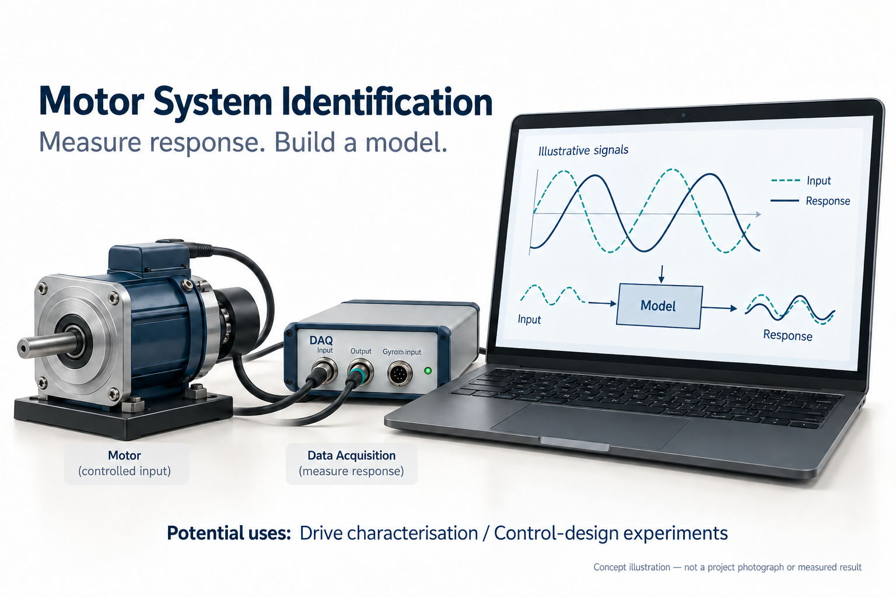
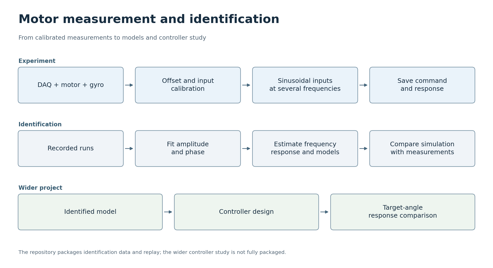

# 모터 제어


[한국어](#korean) · [English](#english)


<a id="korean"></a>

## 한국어


이 디지털 제어 프로젝트에서는 정현파 입력에 대한 모터의 응답을 측정하고, 기록한 데이터로 MATLAB과 Simulink에서 1차 및 2차 모델을 비교했습니다. 약 8주 동안 측정, 모델 식별, 제어기 연구를 연결하여 수행한 프로젝트입니다.


### 프로젝트 목표


명령에 대한 모터의 응답을 측정하고, 제어기 설계에 활용할 수 있는 모델을 식별합니다.





AI로 생성한 개념도입니다. 장치의 외형, 인터페이스 배치, 예시 그래픽은 설명을 위한 표현이며, 실제 프로젝트 사진이나 측정 결과가 아닙니다.


### 활용할 수 있는 곳


이러한 측정·모델링 과정은 제어기를 조정하기 전에 실험실에서 모터 구동 기구의 특성을 파악하는 데 활용할 수 있습니다. 식별한 모델을 측정 응답과 비교하면 제어 실험에 필요한 동작 특성을 모델이 담고 있는지 판단하는 데 도움이 됩니다. 다른 액추에이터에 적용하려면 새 측정과 보정이 필요하며, 보존된 실험만으로 다른 구동 장치의 성능을 입증할 수는 없습니다.


### 한눈에 보기





프로젝트 문서와 코드를 바탕으로 재구성한 개요입니다. 아래 설명에서 결과와 함께 확인된 범위와 검증의 한계를 살펴볼 수 있습니다. [SVG](docs/flowcharts/motor.svg)


### 프로젝트 구성과 팀 역할


프로젝트는 측정 및 보정, 정현파 응답 실험, 모델 식별, 제어기 설계를 다룹니다. 박상헌은 측정 환경 구성, 센서·입력 보정, 응답 데이터 수집 단계에서 먼저 동작하는 결과를 확보했습니다. 김찬중은 모델 식별, 모델 비교, 목표 각도 응답 분석을 포함한 제어기 설계 단계에서 먼저 동작하는 결과를 확보했습니다.


두 팀원 모두 환경 구성부터 제어기 연구까지 전체 과정도 함께 수행했습니다. 이 역할 구분은 각 단계를 누가 먼저 동작하는 결과로 만들었는지 기록한 것이며, 해당 단계를 각자 전담했다는 뜻은 아닙니다. 이 저장소의 파일은 기록된 데이터와 식별 분석에 초점을 맞추고 있으며, 전체 프로젝트에는 제어기 설계 실험도 포함되어 있습니다.


### 측정에서 제어기 연구까지


작업은 DAQ 환경 구성과 센서·입력 보정으로 시작했습니다. 이후 여러 주파수의 정현파 명령을 인가하고, 각 실험 결과를 분석용으로 저장했습니다. MATLAB은 각 주파수에서 기록한 응답에 곡선을 피팅하여 진폭과 위상을 추정하고, 이 측정값들을 주파수 응답으로 결합한 뒤 후보 모델을 식별합니다. Simulink 비교에서는 모델들이 측정 응답을 어떻게 재현하는지 보여 줍니다. 전체 프로젝트는 이후 제어기 설계와 목표 각도 응답 비교로 이어졌습니다.


현재 저장소에는 측정 데이터와 식별 분석의 재실행 자료가 보존되어 있습니다. 이후의 제어기 연구도 프로젝트 이력에 속하지만, 그 실험 환경 전체가 이 패키지에 제공되지는 않습니다.


### 무엇을 측정했는가


확인하려던 것은 변화하는 명령에 모터가 얼마나 크게, 얼마나 빠르게 반응하는가였습니다. 일련의 주파수에서 정현파 입력을 인가하고 출력을 기록했습니다. 느린 입력과 빠른 입력에서는 출력 진폭과 지연이 같지 않으며, 이 관계가 주파수 응답 모델의 바탕이 됩니다.


포함된 데이터셋에는 0.1~1.2 Hz 범위의 실험 12회가 담겨 있습니다. 각 파일은 4,000행이며, 시간, 명령 전압, 저장된 자이로 기반 응답의 세 열로 구성됩니다. 전압 열을 읽을 때는 데이터 수집 프로그램의 선형화 단계 이전 명령이라는 점이 중요합니다. 최종 DAQ 출력을 직접 기록한 값은 아니므로, 이 차이를 바탕으로 응답을 해석해야 합니다. 원래의 데이터 수집 및 보정 환경은 이 파일들만으로 재현되지 않습니다.


### 기록된 응답


이 그래프에는 기록된 0.30 Hz 실험의 샘플 4,000개가 담겨 있습니다. 위쪽 패널은 명령 전압을 보여 줍니다. 센서 보정을 별도로 재확인하지 않았으므로 아래쪽 패널은 원본 데이터에 저장된 응답 단위를 그대로 사용합니다.


### 분석


[chan.m](Gimbal_board/chan.m)은 기록된 실험 데이터를 불러와 각 출력 응답에 정현파를 피팅합니다. 피팅한 진폭과 위상은 해당 시험 주파수에서 모터의 응답을 나타냅니다. 스크립트는 출력 진폭을 지정된 입력 진폭으로 나누어 이득을 구한 뒤, 이득과 위상을 결합하여 복소 주파수 응답을 구성합니다.


이 응답으로 두 개의 후보 전달함수를 식별합니다. 전달함수는 입력과 출력의 관계를 간결한 수학적 모델로 나타냅니다. 여기서 두 번째 후보는 영점 하나와 극점 두 개를 가집니다. 이 모델의 추가 차수는 모터 응답을 피팅한 결과에서 나온 것이며, 속도를 위치로 변환하기 위해 적분기를 덧붙여 생긴 것이 아닙니다. 스크립트는 두 모델의 주파수 응답을 비교하고, [Plant.slx](Simulink/Plant.slx)를 사용해 시뮬레이션 출력과 기록된 응답을 비교합니다.


원본 `chan.m` 스크립트와 이에 딸린 두 번의 `Plant.slx` 시뮬레이션은 2026년 9월 28일 MATLAB R2024b에서 실행했습니다. 스크립트에서 얻은 근사 모델은 다음과 같습니다.


```text

Gp1(s) = 7656 / (s + 13.12)

Gp2(s) = (1.137e4 s + 5.346e4) / (s^2 + 27.32 s + 84.84)

```


이 값들은 보존된 스크립트를 재실행했을 때 얻은 출력을 보여 줍니다. 피팅 루틴에서 국소 최솟값에 도달했을 가능성을 보고했으므로, 별도로 검증된 추정값으로 해석할 수는 없습니다. 재실행 중 모터를 구동하지 않았기 때문에, 이 결과가 확인해 주는 범위에 폐루프 하드웨어 성능은 포함되지 않습니다.


### 분석 재실행


현재 저장소에는 [chan.m](Gimbal_board/chan.m), [Plant.slx](Simulink/Plant.slx), 0.1~1.2 Hz 범위에서 기록한 실험 12회가 포함되어 있습니다. 이 패키지는 2026년 9월 28일 Windows의 MATLAB R2024b에서 재실행에 성공했습니다. 같은 분석을 살펴보려면 저장소 루트에서 MATLAB의 다음 명령을 실행하면 됩니다.


```matlab

cd Gimbal_board

chan

```


스크립트는 작업 공간을 지우고 분석 그래프 창을 엽니다. 스크립트가 인접한 `Simulink` 폴더와 원래 측정 파일 이름을 사용하므로, 재실행할 때도 이 배치를 그대로 유지해야 합니다. Simulink, Control System Toolbox, Signal Processing Toolbox, Optimization Toolbox, Curve Fitting Toolbox를 사용하며, 원래 Windows 경로를 유지하고 있습니다.


응답 그래프를 다시 생성하려면 NumPy와 Matplotlib를 설치하고 저장소 루트에서 `python plot_recorded_response.py`를 실행하면 됩니다. 이 명령은 `portfolio/recorded-response.png`를 생성하며, 기록된 샘플의 값이 유한한지와 시간이 증가하는지 확인합니다. 데이터 수집 소프트웨어와 하드웨어 구성은 포함되어 있지 않습니다.


전체 흐름을 먼저 파악하려면 기록된 응답 그래프를 보고, 이어서 `chan.m`의 피팅 부분을 읽는 순서가 도움이 됩니다. 스크립트 재현은 보존된 데이터와 분석이 함께 실행됨을 보여 줍니다. 다른 모터에 가장 잘 맞는 모델을 입증하거나, 센서 스케일을 별도로 검증하거나, 원래의 폐루프 목표 각도 실험을 반복한 것은 아닙니다.


---


<a id="english"></a>

## English


**Motor System Identification**


This digital-control project measured a motor's response to sinusoidal inputs and used the recorded data to compare first- and second-order models in MATLAB and Simulink. The project lasted about eight weeks and connected measurement, model identification and controller study.


### Project goal


Measure how a motor responds to commands and identify models that can support controller design.


AI-generated concept illustration. Device appearance, interface layout and example graphics are illustrative, not project photographs or measured results.


### Where it could be used


This measurement-and-model workflow can support laboratory characterisation of a motor-driven mechanism before controller tuning. Comparing an identified model with measured response can help decide whether the model captures the behaviour needed for a control experiment. Applying it to another actuator would require new measurements and calibration; the saved experiment does not establish performance for a different drive.


### At a glance


This overview is reconstructed from the project documentation and code. The sections below explain the results, what was checked and the limits of that verification. [SVG](docs/flowcharts/motor.svg)


### Project configuration and team


The project covers measurement and calibration, sinusoidal response experiments, model identification and controller design. Sangheon Park first obtained working results for the measurement setup, sensor/input calibration and response-data collection. 김찬중 first obtained working results for model identification, model comparisons and controller design with target-angle response analysis.


Both members also worked through the complete process from setup to controller study. This division records who first brought each stage to a working result, rather than exclusive ownership of those stages. The files in this repository focus on the recorded data and identification analysis; the wider project also included controller-design experiments.


### From measurement to controller study


The work began with the DAQ setup and sensor/input calibration. Sinusoidal commands were then applied at several frequencies, with each run saved for analysis. MATLAB fits the recorded response at each frequency to estimate its amplitude and phase, combines those measurements into a frequency response, and identifies candidate models. Simulink comparisons show how those models reproduce the measured response. The wider project continued into controller design and target-angle response comparisons.


The repository currently preserves the measurement data and identification replay. The later controller study belongs to the project history, but its complete experiment setup is not supplied by this package.


### What was measured


The question was how strongly, and how quickly, the motor responded to a changing command. We applied sinusoidal inputs at a sequence of frequencies and recorded the output. A slow input and a faster input do not produce the same output amplitude or delay; that relationship is the basis of the frequency-response model.


The included dataset contains twelve runs from 0.1 to 1.2 Hz. Each file has 4,000 rows with three columns: time, command voltage and the stored gyro-derived response. To interpret the voltage column, keep in mind that it records the command before the acquisition program's linearisation step. It is not a direct recording of the final DAQ output. The original acquisition and calibration setup is not reproduced by these files.


### Recorded response


This plot contains 4,000 samples from a recorded 0.30 Hz experiment. The upper panel shows command voltage. The lower panel uses the response units stored in the original data because the sensor calibration has not been independently rechecked.


### Analysis


[chan.m](Gimbal_board/chan.m) loads the recorded runs and fits a sinusoid to each output response. The fitted amplitude and phase describe the motor's response at that test frequency. The script divides the output amplitude by the prescribed input amplitude to obtain gain, then combines gain and phase into a complex frequency response.


It uses that response to identify two candidate transfer functions. A transfer function describes the relationship between input and output in a compact mathematical model. Here, the second candidate has one zero and two poles; its extra order comes from the fitted motor response, not from appending an integrator to convert velocity to position. The script compares the models' frequency responses and uses [Plant.slx](Simulink/Plant.slx) to compare simulated output with the recorded response.


The original `chan.m` script and its two `Plant.slx` simulations ran in MATLAB R2024b on 28 September 2026. The script produced these approximate models:


```text

Gp1(s) = 7656 / (s + 13.12)

Gp2(s) = (1.137e4 s + 5.346e4) / (s^2 + 27.32 s + 84.84)

```


These values show the output of the preserved script when replayed. The fitting routine reported possible local minima, so the estimates cannot be considered independently validated. No motor was operated during the replay, which also leaves closed-loop hardware performance unverified.


### Replaying the analysis


The repository now includes [chan.m](Gimbal_board/chan.m), [Plant.slx](Simulink/Plant.slx) and the twelve recorded runs from 0.1 to 1.2 Hz. This package was replayed successfully in MATLAB R2024b on Windows on 28 September 2026. To explore the same analysis, run the following commands in MATLAB from the repository root:


```matlab

cd Gimbal_board

chan

```


The script clears the workspace and opens its analysis figures. The script expects the neighbouring `Simulink` folder and the original measurement filenames, so keeping that layout intact is necessary for replay. The script uses Simulink, Control System Toolbox, Signal Processing Toolbox, Optimization Toolbox and Curve Fitting Toolbox; its original Windows paths are retained.


To regenerate the response plot, install NumPy and Matplotlib and run `python plot_recorded_response.py` from the repository root. It writes `portfolio/recorded-response.png` and checks the recorded samples for finite values and increasing time. The acquisition software and hardware setup are not included.


For an introduction to the analysis, the recorded-response plot is a useful starting point. You can then follow the fitting section in `chan.m` to see how the data is used. Reproducing the script demonstrates that the preserved data and analysis run together. It does not establish a best-fit model for another motor, independently validate the sensor scale, or repeat the original closed-loop target-angle experiment.

