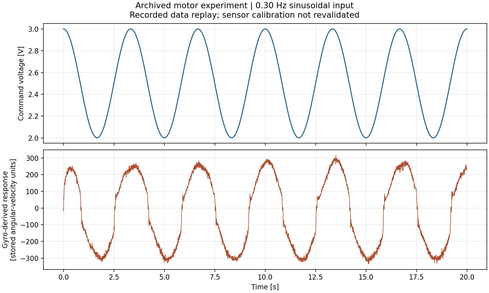

# Motor System Identification

**Control engineering case study · recorded-data replay · two-person coursework**



A digital-control project connecting sinusoidal motor experiments, frequency-response
analysis and model comparison. The work ran for approximately eight weeks and used
C/C++ acquisition code with MATLAB/Simulink analysis.

[Portfolio home](https://github.com/oldprize47-SH)

## My contribution and the team boundary

I worked on applying sinusoidal inputs at different frequencies, analysing measured
responses and using a motor model for controller design and target-angle checks.
The final measurements used gyroscope-derived angular velocity; earlier angle-sensor
and FFT experiments were a separate development stage. This was a two-person project,
not a claim that I alone wrote all acquisition and analysis code.

## Engineering workflow


The figure above replays 4,000 samples from the archived 0.30 Hz experiment. The
upper panel is command voltage; the lower panel retains the stored response units
because sensor calibration was not independently revalidated.

## What was reproduced

On 28 September 2026, MATLAB R2024b ran the existing `chan.m` analysis and its two
`Plant.slx` simulations to completion. The script printed approximately:

```text
Gp1(s) = 7656 / (s + 13.12)
Gp2(s) = (1.137e4 s + 5.346e4) / (s^2 + 27.32 s + 84.84)
```

These are reproduced script outputs, not independently validated model estimates.
The fitting routine reported possible local minima. Original graphs labelled
“True Value” refer to recorded/derived reference data, not absolute ground truth.
The separate data-preview pass checked finite values and strictly increasing time.
No motor was actuated during replay.

## Decisions to discuss

- Why use measured input/output response instead of assuming a motor transfer function?
- How do first- and second-order models differ against the same archived response?
- Which discrepancies could come from sensor calibration, model structure or the experiment?
- Why does successful model replay not establish closed-loop hardware performance?

## Repository scope

This is a **public case study**, containing the explanation and replay figure.
The full coursework source, data archive and proprietary-toolbox environment have
not been repackaged here. This repository therefore has no standalone build or
one-command reproduction claim. It does not establish new tracking errors, stability
margins or performance beyond the recorded experiment.
